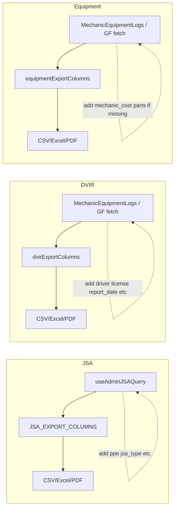

# Safety Compliance Export Upgrade Plan (Production-Ready) — REVISED

**Full detailed revised plan** (includes code samples, complete acceptance criteria tables, rollback step-by-step, enhancement roadmap with effort estimates): **docs/SafetyCompliance-Export-Upgrade-Plan-REVISED.md**

Refer to full plan for: TypeScript interfaces and code examples (§1.2, §2.3, §3.2, §4.1); complete COMPLIANCE_TRACEABILITY table (§6.2); rollback command reference (§7.2); enhancement roadmap with priorities (§8).

**Key changes from original:** Compliance review gate before JSA implementation; mandatory testing for all formatters (not conditional); PDF layout decision matrix; performance baselines and backward-compatibility tests; rollback plan; user communication (changelog, tooltips); export volume limits and large-export warning.

---

## Quick Start Guide

**Before you begin:**

1. Read this summary completely.
2. Record performance baselines (§Performance baseline).
3. Review full plan at docs/SafetyCompliance-Export-Upgrade-Plan-REVISED.md for code examples.

**Implementation sequence:**

1. **Slice 0 (2–3 days):** Foundation — MUST complete first.
2. **Slice 1 (5–7 days):** JSA — REQUIRES compliance review gate.
3. **Slices 2–3 (7–9 days):** DVIR + Equipment — Can run in parallel after Slice 0.

**Critical gates:**

- Performance baselines recorded before Slice 0.
- Compliance team approves JSA format before Slice 1 implementation.
- All formatters have unit tests (not optional).
- Backward compatibility verified for each slice.

**In PR descriptions:** Link implementation guide (this summary) and full specification: docs/SafetyCompliance-Export-Upgrade-Plan-REVISED.md.

---

## Red Flags — Stop and Escalate

**STOP implementation if:**

- Compliance team has not approved JSA format (Slice 1).
- Performance baseline not recorded.
- Any formatter lacks unit tests.
- Export success rate <90% in staging.

**ESCALATE to product/compliance if:**

- Summary format rejected (need individual columns plan).
- Export time >60s cannot be achieved.
- Hard limits (5000 rows) blocking critical use case.

---

## Current state

**JSA ([src/pages/admin/admin-jsa/constants.ts](src/pages/admin/admin-jsa/constants.ts))**

- Export columns: Job Date, Location, Circuit Number, Submitted By, Status, Employee Signature, Nearest Hospital/Clinic, Notes, Updated. **Missing from export:** jobs_performed, call_in_time, call_out_time, oc/doc/gf/safety_contact, ppe (all items), weather_conditions, weather_hazards, hazards_present (each item), traffic_hazards (each), traffic_setup (each), spans (all step rows: location, hazards, mitigation, initials), observer_signatures, shared_with_users, employee_signature_path, jsa_type, tree_felling_data, status_changed_at, completed_at, status_history.
- Admin JSA query ([src/hooks/queries/useAdminJSAQuery.ts](src/hooks/queries/useAdminJSAQuery.ts)) already fetches jobs_performed, weather_conditions, hazards_present, traffic_*, spans, observer_signatures, shared_with_users, call_in/out, contacts, weather_hazards. It does **not** select: `ppe`, `employee_signature_path`, `status_changed_at`, `completed_at`, `status_history`, `jsa_type`, `tree_felling_data`.

**DVIR ([src/pages/mechanic/equipment-logs/exportColumns.ts](src/pages/mechanic/equipment-logs/exportColumns.ts))**

- Export columns: Date, Truck #, Driver Name, Mileage, Chipper #, Trailer #, Vehicle Failures (aggregated), Aerial Failures (aggregated), Has Mechanic Fix, Fix Applied, Mechanic Remarks, Driver Notes. **Missing:** full vehicle_trailer_checklist and aerial_checklist (each item as P/F/N/A), truck_gvwr, trailer_chipper_gvwr, medical_card_required, drivers_license_*, has_medical_card, medical_card_exp, copy_of_registration, copy_of_insurance, aerial_notes, mechanic_truck_number, mechanic_date, report_date, photo/signature present (Yes/No), mechanic_cost, mechanic_parts_used (formatted).
- Mechanic DVIR fetch ([src/pages/mechanic/MechanicEquipmentLogs.tsx](src/pages/mechanic/MechanicEquipmentLogs.tsx)) does not select: report_date, truck_gvwr, trailer_chipper_gvwr, medical_card_required, drivers_license_number, drivers_license_class, drivers_license_exp, drivers_license_required, has_medical_card, medical_card_exp, copy_of_registration, copy_of_insurance, aerial_notes. General Foreman fetch ([src/pages/general-foreman/GeneralForemanEquipmentLogs.tsx](src/pages/general-foreman/GeneralForemanEquipmentLogs.tsx)) also omits mechanic_cost, mechanic_parts_used.

**Equipment ([src/pages/mechanic/equipment-logs/exportColumns.ts](src/pages/mechanic/equipment-logs/exportColumns.ts))**

- Export columns: Inspection Date, Equipment Number, Type, Submitted By, General Failures (aggregated), Specific Failures (aggregated), Has Mechanic Fix, Mechanic Notes, Inspector Notes, Last Updated. **Missing:** created_at, template, full general_checklist and specific_checklist (each item P/F/N/A), overview/damage/attachments/hydraulic photo present (Yes/No), mechanic_cost, mechanic_parts_used (formatted), additional_photo_paths (if present in DB).
- Equipment fetch in MechanicEquipmentLogs already includes mechanic_cost, mechanic_parts_used; General Foreman fetch omits them. Migration [20260229200004_equipment_additional_photo_paths.sql](supabase/migrations/20260229200004_equipment_additional_photo_paths.sql) adds `additional_photo_paths`; include in select if we want it in exports.

---

## Performance baseline (required before implementation)

Before implementing any slice, establish current performance metrics and record in **tests/PERFORMANCE_BASELINES.md** or CHANGELOG:

| Metric                      | Measurement          | Target post-implementation                   |
| --------------------------- | -------------------- | -------------------------------------------- |
| Export time (100 rows, CSV) | Time current export  | <60s; no >20% regression from baseline       |
| Export time (500 rows)      | Time current export  | Baseline only                                |
| File size (100 rows, CSV)   | Downloaded file size | <10MB                                        |
| Memory during export        | DevTools heap        | <200MB increase                              |

**Action:** Record baselines before starting Slice 0.

---

## Implementation approach

Use the existing export pipeline ([src/lib/exportUtils.ts](src/lib/exportUtils.ts) `DataExporter`, CSV/Excel/PDF) and column-driven format. For each form:

1. **Ensure fetch includes all DB columns** needed for the full export (add missing columns to Admin JSA query and to DVIR/Equipment fetches where exports run).
2. **Extend TypeScript types** so export columns can reference new fields (e.g. extend `DVIRReport` for driver/license/medical fields).
3. **Expand export column definitions** to include every field, with formatters for:
   - **Checklists:** One column per checklist item (e.g. "Air Compressor", "Batteries", …) with value P / F / N/A, or a single formatted text column per checklist section.
   - **Complex structures:** PPE (e.g. "Hard hats: Required, Good"), spans (e.g. "Span 1: location | hazards | mitigation | initials" repeated or multiple columns), observer_signatures (names/dates), mechanic_parts_used (e.g. "Part A x2; Part B x1").
   - **Photos/signatures:** Export "Yes"/"No" or path; avoid embedding binary in CSV/Excel.
4. **Keep PDF/Excel readable:** For PDF, consider grouping full form data per record (e.g. one section per JSA) or a wide table; for Excel, use one row per record with many columns; for CSV, same as Excel. Ensure column counts stay manageable (e.g. flatten spans to a fixed number of "Span N – Location/Hazards/Mitigation/Initials" columns or one "Spans (summary)" column).

---

## 1. JSA export (Admin)

**1.0 Pre-implementation compliance review (BLOCKING)**

Before implementing JSA export changes, obtain written approval from compliance team on export format.

- **Deliverable:** Sample export (CSV and PDF) with mock data showing PPE format, spans format (summary vs individual columns), hazards format, signatures/observers.
- **Approval criteria:** Compliance confirms format meets OSHA 1926.20(b)(1) and 1926.21 documentation requirements; safety director signs off; decision documented (summary vs full expansion).
- **Timeline:** Allow 3–5 business days for review.
- **Fallback:** If summary format is rejected, implement individual span columns per enhancement roadmap (§8.1 in full revised plan).

**1.1 Query**

- In [src/hooks/queries/useAdminJSAQuery.ts](src/hooks/queries/useAdminJSAQuery.ts), add to the `daily_jsa` select: `ppe`, `employee_signature_path`, `status_changed_at`, `completed_at`, `status_history`, `jsa_type`, `tree_felling_data`.

**1.2 Export columns**

- In [src/pages/admin/admin-jsa/constants.ts](src/pages/admin/admin-jsa/constants.ts), expand `JSA_EXPORT_COLUMNS` to include (with appropriate formatters):
  - **Job info:** job_date, work_location, circuit_number, call_in_time, call_out_time, jobs_performed (format as labels or comma-separated), user_name, user_email, status, jsa_type.
  - **Contacts:** oc_contact, doc_contact, gf_contact, safety_contact, nearest_hospital, nearest_clinic.
  - **PPE:** One column per PPE item (from [dailyJSAFormState.ts](src/pages/forms/dailyJSAFormState.ts) PPE_ITEMS) with value like "Required, Good" / "Required, Needs Replaced" / "Not Required", or a single "PPE" column with concatenated summary.
  - **Weather:** weather_conditions (conditions + modifiers), weather_hazards (text).
  - **Hazards:** hazards_present (comma-separated labels of checked items, using HAZARD_ITEMS), traffic_hazards (same, TRAFFIC_HAZARDS), traffic_setup (same, TRAFFIC_SETUP).
  - **Spans (recommended for initial release):** Use **Option B** — a single "Spans" column with formatted summary (e.g. "1: loc | hazards | mitigation | init; 2: …") via a `formatSpansSummary(row.spans)` formatter. Rationale: 21 spans × 4 fields = 84 columns is unwieldy for most export use cases; a summary column is more practical for auditors while keeping full data accessible. **Option A** (individual columns "Span 1 Location", "Span 1 Hazards", etc.) may be added as a follow-up enhancement. Example: `{ key: 'spans_summary', label: 'Spans', format: (_, row) => formatSpansSummary(row.spans) }`.
  - **Signatures / sharing:** employee_signature (or "Signed" if present), employee_signature_path (Yes/No or path), observer_signatures (e.g. names + dates), shared_with_users (e.g. emails or "None").
  - **Other:** notes, created_at, updated_at, status_changed_at, completed_at; optionally status_history, tree_felling_data (summary or omit if too large).

**1.3 Detail modal alignment**

- Reuse the same label sets (PPE_ITEMS, HAZARD_ITEMS, TRAFFIC_HAZARDS, TRAFFIC_SETUP) and span shape from [dailyJSAFormState.ts](src/pages/forms/dailyJSAFormState.ts) and [JsaDetailModal](src/components/history/JsaDetailModal.tsx) so export matches what users see.

---

## 2. DVIR export (Mechanic / General Foreman)

**2.1 Type**

- In [src/pages/mechanic/equipment-logs/types.ts](src/pages/mechanic/equipment-logs/types.ts), extend `DVIRReport` with optional fields: report_date, truck_gvwr, trailer_chipper_gvwr, medical_card_required, drivers_license_number, drivers_license_class, drivers_license_exp, drivers_license_required, has_medical_card, medical_card_exp, copy_of_registration, copy_of_insurance, aerial_notes. (Match [dvir_reports](supabase/migrations/20251122072438_create_dvir_reports_table.sql) schema.)

**2.2 Fetch**

- In [src/pages/mechanic/MechanicEquipmentLogs.tsx](src/pages/mechanic/MechanicEquipmentLogs.tsx), add to DVIR select: report_date, truck_gvwr, trailer_chipper_gvwr, medical_card_required, drivers_license_number, drivers_license_class, drivers_license_exp, drivers_license_required, has_medical_card, medical_card_exp, copy_of_registration, copy_of_insurance, aerial_notes.
- In [src/pages/general-foreman/GeneralForemanEquipmentLogs.tsx](src/pages/general-foreman/GeneralForemanEquipmentLogs.tsx), add the same driver/license/medical/report_date fields and mechanic_cost, mechanic_parts_used to the DVIR (and equipment) select so exports from that screen are also complete.

**2.3 Export columns**

- In [src/pages/mechanic/equipment-logs/exportColumns.ts](src/pages/mechanic/equipment-logs/exportColumns.ts), expand `dvirExportColumns` to include:
  - **Identity / date:** id (optional), created_at, report_date.
  - **Vehicle / driver:** truck_number, mileage, drivers_name, chipper_number, trailer_number, truck_gvwr, trailer_chipper_gvwr, medical_card_required, drivers_license_number, drivers_license_class, drivers_license_exp, drivers_license_required, has_medical_card, medical_card_exp, copy_of_registration, copy_of_insurance.
  - **Checklists:** One column per item in VEHICLE_TRAILER_ITEMS and AERIAL_LIFT_ITEMS with value P / F / N/A (or blank), so every inspection point is exported.
  - **Notes:** notes, aerial_notes.
  - **Mechanic:** mechanic_truck_number, mechanic_date, deficiency_corrected, mechanic_remarks, mechanic_cost (formatted currency), mechanic_parts_used (e.g. "PartName x qty; …" using [exportUtils](src/lib/exportUtils.ts) or a small formatter).
  - **Photos / signatures:** For each of oil_dipstick_path, tire_photo_path, coolant_photo_path, damage_photo_path, detail_clean_truck_photo_path, final_driver_signature, general_foreman_signature, mechanic_signature, driver_approval_signature, add a column "<Label> (Present)" with Yes/No (or "Path" if you prefer to export the path string).

---

## 3. Equipment inspection export (Mechanic / General Foreman)

**3.1 Fetch**

- In [src/pages/general-foreman/GeneralForemanEquipmentLogs.tsx](src/pages/general-foreman/GeneralForemanEquipmentLogs.tsx), add mechanic_cost, mechanic_parts_used to the equipment select.
- If `additional_photo_paths` exists on the table and is needed for "all data", add it to both Mechanic and General Foreman equipment selects.

**3.2 Export columns**

- In [src/pages/mechanic/equipment-logs/exportColumns.ts](src/pages/mechanic/equipment-logs/exportColumns.ts), expand `equipmentExportColumns` to include:
  - **Identity / date:** id (optional), created_at, inspection_date, equipment_type, equipment_number, template, submitted_by.
  - **Checklists:** One column per item in GENERAL_EQUIPMENT_ITEMS; for specific_checklist, use SPECIFIC_ITEMS by row.template to get the right list and add one column per item (P/F/N/A).
  - **Notes:** notes, mechanic_fixes (and last_mechanic_updated_at), mechanic_cost, mechanic_parts_used (formatted).
  - **Photos:** For overview_photo_path, damage_photo_path, attachments_photo_path, hydraulic_photo_path (and additional_photo_paths if present), add "<Label> (Present)" Yes/No columns.

---

## 4. Cross-cutting

**4.1 Explicit formatter interfaces and helpers (exportUtils.ts)**

Before implementation, define formatter interfaces and signatures in [src/lib/exportUtils.ts](src/lib/exportUtils.ts) so all slices use consistent types:

- **MechanicPart** (for export formatting; align with existing [MechanicPart](src/pages/mechanic/equipment-logs/types.ts) if already defined): `{ part_name: string; quantity: number; part_number?: string; cost?: number }`.
- **formatMechanicPartsUsed(parts: MechanicPart[] | null): string** — returns e.g. `"PartName x2; OtherPart x1"` or `"N/A"`.
- **formatSpansSummary(spans: JsaSpan[] | null | undefined): string** — returns formatted summary for JSA spans (e.g. `"1: loc | hazards | mitigation | init; 2: …"`).
- **formatChecklistFull** or per-checklist formatter — given checklist object and list of items, return P/F/N/A per item or a single formatted string for PDF.

Export columns then reference these helpers so logic stays DRY and testable.

**4.2 Export format–aware column selection (PDF)**

Add a format-aware column selector so PDF can use a reduced column set and avoid horizontal overflow:

- **ExportFormat** type: `'csv' | 'excel' | 'pdf'`.
- **getExportColumns(allColumns: ExportColumn[], format: ExportFormat): ExportColumn[]** — for `pdf`, return a subset (e.g. summary columns + "Spans summary", "Full checklist" text column); for `csv` and `excel`, return all columns. Call this in each export handler before passing columns to DataExporter.

**4.3 Idempotency for exports**

In the **DataExporter** class (or at call site), add an **exportInProgress** guard so duplicate clicks or timeout retries do not start a second export:

- Before starting export: if `exportInProgress` is true, log a warning and return (or resolve without writing a second file).
- Set `exportInProgress = true` at start, `false` in finally.
- **Scope:** Guard prevents duplicate exports in the same tab only. Multi-tab duplicate downloads are handled by the browser download manager.

**4.4 ExportUtils (existing)**

- [src/lib/exportUtils.ts](src/lib/exportUtils.ts) already supports custom `format` per column and metadata. Add the helpers above and reuse them in JSA/DVIR/Equipment export column definitions.

**4.5 PDF layout (decision matrix)**

- **<50 records:** Summary columns (landscape). **50–200 records:** Summary columns (landscape). **200+ records:** Warn user; suggest filtering or CSV. **Checklist exports:** Always use summary columns in PDF (individual item columns cause horizontal overflow).
- For PDF, use **getExportColumns(..., 'pdf')** to pass a reduced set. Full per-item columns remain in CSV/Excel only.

**4.6 Backward compatibility**

- All new fields on row types must be optional so cached data and existing API responses do not break (e.g. report_date, driver license fields on DVIRReport). Formatters must handle null/undefined.

---

## 5. Production-ready guidelines

Aligned with [SafetyCompliance-ProductionPlan.md](SafetyCompliance-ProductionPlan.md) and [ProductionReadinessFindings.md](ProductionReadinessFindings.md): one deployable slice per area, acceptance criteria and tests per deliverable, no big-bang release.

**Deployable slices (execution order):**

- **Slice 0 (foundation):** Shared exportUtils formatters, getExportColumns, idempotency guard. MUST be merged first.
- **Slices 1 (JSA), 2 (DVIR), 3 (Equipment):** Each depends only on Slice 0; can run in parallel after Slice 0. Slice 1 requires compliance review gate before implementation.

Dependency: Slice 0 → blocks → Slice 1 (JSA) | Slice 2 (DVIR) | Slice 3 (Equipment). Each slice goes through staging validation per §5.5 before production deployment.

### 5.1 Acceptance criteria (by deliverable)

| Id     | Deliverable                        | Acceptance criteria                                                                                                                                                                                                                                                                                                                                                                                                                                                                                                                                                                                                                             |
| ------ | ---------------------------------- | ----------------------------------------------------------------------------------------------------------------------------------------------------------------------------------------------------------------------------------------------------------------------------------------------------------------------------------------------------------------------------------------------------------------------------------------------------------------------------------------------------------------------------------------------------------------------------------------------------------------------------------------------- |
| JSA-1  | Admin JSA query + export columns   | 1) useAdminJSAQuery selects ppe, employee_signature_path, status_changed_at, completed_at, status_history, jsa_type, tree_felling_data. 2) JSA CSV/Excel/PDF export includes job info, contacts, PPE (all items), weather, hazards (present/traffic/setup), spans (all steps or formatted summary), observer_signatures, shared_with_users, signatures, notes, timestamps, jsa_type. 3) Export completes in under 60s for default page size (e.g. 50–100 rows). 4) No regression: existing JSA list/detail and export still work.                                                                                                               |
| DVIR-1 | DVIR type + fetch + export columns | 1) DVIRReport type includes optional report_date, truck_gvwr, trailer_chipper_gvwr, driver/license/medical fields, aerial_notes. 2) Mechanic and General Foreman DVIR fetches select all columns needed for full export (including mechanic_cost, mechanic_parts_used for GF). 3) DVIR export includes identity/dates, vehicle/driver (including GVWR, license, medical, registration/insurance), every vehicle_trailer and aerial checklist item (P/F/N/A), notes, mechanic section, mechanic_cost and mechanic_parts_used (formatted), photo/signature present (Yes/No). 4) Export under 60s for typical range; no regression on list/detail. |
| EQ-1   | Equipment fetch + export columns   | 1) General Foreman equipment fetch includes mechanic_cost, mechanic_parts_used; both Mechanic and GF include additional_photo_paths if column exists. 2) Equipment export includes identity/dates, template, every general and template-specific checklist item (P/F/N/A), notes, mechanic_fixes, mechanic_cost, mechanic_parts_used (formatted), photo present (Yes/No). 3) Export under 60s; no regression.                                                                                                                                                                                                                                   |

### 5.2 Definition of done (all slices)

- All acceptance criteria above met for JSA, DVIR, and Equipment.
- No database migrations required (confirmed); no schema changes.
- No regression: existing export buttons, list views, and detail modals behave as before.
- **Unit tests REQUIRED for all formatters** (formatMechanicPartsUsed, formatSpansSummary, formatChecklistFull, formatPPEItems, formatPhotoPresent, formatSignaturePresent, etc.). Minimum: happy path + null/undefined + edge cases. Not conditional on "non-trivial" — all formatters handling compliance data must be tested.
- E2E or manual test: Admin JSA export (CSV + Excel + PDF) with at least one record containing spans, PPE, hazards; Mechanic and GF DVIR export with full checklist and driver fields; Equipment export with full checklist and mechanic parts. Spot-check that exported files contain all new columns/values.
- **Backward compatibility test:** Verify export works with records created before this change (missing new optional fields). Export must not crash; show N/A or empty for missing fields.
- Documentation: [docs/CSV-PDF-Exports.md](CSV-PDF-Exports.md) (or equivalent) updated with full column lists for JSA, DVIR, and Equipment exports; [tests/COMPLIANCE_TRACEABILITY.md](../tests/COMPLIANCE_TRACEABILITY.md) updated to add export coverage row(s) for "Full form data export (JSA / DVIR / Equipment)" and test file references.
- Performance: Export generation under 60s for standard date range and page size (per ATTS-Compliance-Engine approved plan); no blocking UI; loading/disabled state on export button during generation.

### 5.3 Test requirements

**Test coverage priority (by compliance risk):**

| Priority | Test                                      | Rationale                           |
| -------- | ----------------------------------------- | ----------------------------------- |
| P0       | DVIR checklist export (all items P/F/N/A) | DOT 396.11/396.13 audit requirement |
| P0       | JSA hazards + spans export                | OSHA 1926.20 documentation          |
| P1       | Mechanic parts/cost export                | Financial audit trail               |
| P1       | Photo/signature presence indicators       | Chain of custody                    |
| P2       | PPE item breakdown                        | Secondary compliance data           |

**Scope and locations:**

| Scope        | Requirement                                                                                                                          | Test file / location                                                                                                                                          |
| ------------ | ------------------------------------------------------------------------------------------------------------------------------------ | ------------------------------------------------------------------------------------------------------------------------------------------------------------- |
| Formatters   | formatMechanicPartsUsed, formatSpansSummary, formatChecklistFull (or per-checklist formatter), JSA PPE/weather/hazards formatters    | Unit tests in `src/lib/exportUtils.test.ts` or `src/pages/mechanic/equipment-logs/exportColumns.test.ts` (create if needed); or colocated with exportColumns. |
| E2E export   | Admin JSA: trigger CSV export, assert file download and that content includes expected headers/values for at least one full record   | `tests/e2e/admin-tools.spec.ts` or `admin-jsa.spec.ts`.                                                                                                       |
| E2E export   | Mechanic/GF: trigger DVIR and Equipment export (CSV or Excel), assert download and presence of full checklist columns and new fields | `tests/e2e/admin-tools.spec.ts` or mechanic/equipment-logs spec.                                                                                              |
| Traceability | Export columns documented and mapped to compliance (DVIR 396.11/396.13, JSA 1926.20/1926.21, Equipment 1910.178)                     | [tests/COMPLIANCE_TRACEABILITY.md](../tests/COMPLIANCE_TRACEABILITY.md) — add subsection or row for "Full form export (all checklist items and form fields)".    |

### 5.4 Risks and mitigations

| Risk                                                           | Mitigation                                                                                                                                                                                                                                                                                                |
| -------------------------------------------------------------- | --------------------------------------------------------------------------------------------------------------------------------------------------------------------------------------------------------------------------------------------------------------------------------------------------------- |
| Large export timeout or memory (e.g. 1000+ rows, many columns) | Keep exports scoped to current filter/page or add explicit "Export current page" vs "Export all in range" with a reasonable cap (e.g. 500 or 1000 rows) and user warning. Soft/hard limits (§5.8). Test with 1000 rows + full checklist: verify <60s and <100MB. Target <60s for standard range. |
| PDF overflow (too many columns)                                | Use landscape; limit PDF to summary columns + one "Full checklist" or "Spans summary" text column if needed; or split PDF into one section per record. Full columns remain in CSV/Excel.                                                                                                                  |
| Backward compatibility                                         | All new type fields optional; formatters handle null/undefined; existing cached query results remain valid.                                                                                                                                                                                               |
| General Foreman type drift                                     | Ensure [src/pages/general-foreman/equipment-logs/types.ts](src/pages/general-foreman/equipment-logs/types.ts) (if separate) stays in sync with mechanic DVIRReport/EquipmentInspection or re-export from shared types.                                                                                    |
| Checklist item order drift                                     | If checklist constants change, export columns can become misaligned. Mitigation: Add Jest test that compares export column keys against VEHICLE_TRAILER_ITEMS (and other constants); fail if count mismatch or missing key for any item ID.                                                               |

### 5.5 Rollout and validation

- **Staging:** Deploy export changes to staging; run E2E export tests and manual spot-checks. Confirm export <60s for 100-row dataset; CSV <10MB, Excel <25MB for 100 rows.
- **Production:** Deploy after staging sign-off. Monitor: export success rate (target >95%), completion time (p95 <45s), client errors, support tickets.
- **Sign-off:** JSA slice requires compliance team approval of export format before production. Optional ops sign-off for DVIR/Equipment.

**Rollback:** If exports fail in production, revert export column definitions to previous version. Data fetch and type changes are backward compatible and safe to keep. No database migrations; no data loss.

### 5.6 Documentation updates

- **docs/CSV-PDF-Exports.md:** Extend to document JSA full export columns (job, contacts, PPE, weather, hazards, spans, signatures, etc.), DVIR full columns (vehicle/driver, per-item checklists, mechanic, photos/signatures), Equipment full columns (per-item checklists, photos, mechanic cost/parts). Include note that PDF may use summary columns for readability.
- **tests/COMPLIANCE_TRACEABILITY.md:** Add row(s) under DVIR 396.11/396.13, JSA 1926.20/1926.21, Equipment 1910.178 for "Full form data export (all checklist items and form fields)" with test file references.

### 5.7 Validation checklist (before each slice merge)

Before merging each slice (JSA, DVIR, Equipment), verify:

- New select fields added to the query for that form.
- TypeScript types updated with optional fields where needed.
- Export columns extended with formatters; PDF uses getExportColumns(..., 'pdf') for reduced set.
- Unit tests for **all** new formatters pass (happy path + null/undefined + edge cases).
- E2E export test downloads file and asserts expected headers (and key values for P0/P1).
- Export completes in <60s for a 100-row dataset; no >20% regression from baseline.
- Backward compatibility: export works with records missing new optional fields.
- PDF renders without horizontal overflow.
- **Type sync (DVIR/Equipment):** Confirm GF and Mechanic use same DVIRReport/EquipmentInspection type (or re-export from shared types).
- COMPLIANCE_TRACEABILITY.md updated for that form's export.
- docs/CSV-PDF-Exports.md updated with new columns for that form.

### 5.8 Export volume limits and user warnings

- **Soft limit (warning):** CSV/Excel 1000 rows, PDF 200 rows. Show confirmation: "Large export (N rows). May take up to 60 seconds. Continue?"
- **Hard limit (block):** CSV/Excel 5000 rows, PDF 500 rows. "Export exceeds maximum. Please filter your data."
- **Large-export warning:** For exports >500 rows or >100 columns: "Consider filtering date range or use Excel format for better performance."

### 5.9 User communication

- **Changelog:** Document new export fields; note backward compatible; old forms show N/A for new fields.
- **In-app:** Optional tooltip on export button: "Now includes complete form data."

### 5.10 Rollback plan

- **When:** Export completely broken; success rate <90% for 1+ hour; critical data issue.
- **Procedure:** Revert export column definitions (and handler if needed). Keep query/type changes. Deploy revert; verify; monitor 30 min.
- **Data safety:** No migrations; no data loss; exports revert to previous column set.

---

## Summary diagram

---

## Files to touch (summary)

| Area              | File                                                                                                                     | Change                                                                                                                                                                                                                            | Priority          |
| ----------------- | ------------------------------------------------------------------------------------------------------------------------ | --------------------------------------------------------------------------------------------------------------------------------------------------------------------------------------------------------------------------------- | ----------------- |
| ExportUtils       | [src/lib/exportUtils.ts](src/lib/exportUtils.ts)                                                                         | Add formatter interfaces (MechanicPart, etc.), formatMechanicPartsUsed, formatSpansSummary, formatChecklistFull; ExportFormat type and getExportColumns(allColumns, format); DataExporter exportInProgress guard for idempotency. | P0 (Slice 0)      |
| Tests             | New or existing E2E/unit                                                                                                 | Unit tests for export formatters; E2E for JSA/DVIR/Equipment export flows (see §5.3)                                                                                                                                              | P0 (Slice 0)      |
| JSA query         | [src/hooks/queries/useAdminJSAQuery.ts](src/hooks/queries/useAdminJSAQuery.ts)                                           | Add ppe, employee_signature_path, status_changed_at, completed_at, status_history, jsa_type, tree_felling_data to select                                                                                                          | P1 (Slice 1)      |
| JSA export        | [src/pages/admin/admin-jsa/constants.ts](src/pages/admin/admin-jsa/constants.ts)                                         | Expand JSA_EXPORT_COLUMNS with all job/contact/PPE/weather/hazards/spans/signature fields and formatters                                                                                                                          | P1 (Slice 1)      |
| DVIR type         | [src/pages/mechanic/equipment-logs/types.ts](src/pages/mechanic/equipment-logs/types.ts)                                 | Add optional report_date, truck_gvwr, trailer_chipper_gvwr, driver/license/medical fields, aerial_notes to DVIRReport                                                                                                             | P2 (Slice 2)      |
| DVIR fetch        | [src/pages/mechanic/MechanicEquipmentLogs.tsx](src/pages/mechanic/MechanicEquipmentLogs.tsx)                             | Add full DVIR columns to select                                                                                                                                                                                                   | P2 (Slice 2)      |
| DVIR fetch        | [src/pages/general-foreman/GeneralForemanEquipmentLogs.tsx](src/pages/general-foreman/GeneralForemanEquipmentLogs.tsx)   | Add full DVIR + mechanic_cost/parts and same for equipment                                                                                                                                                                        | P2 (Slice 2)      |
| DVIR/Equip export | [src/pages/mechanic/equipment-logs/exportColumns.ts](src/pages/mechanic/equipment-logs/exportColumns.ts)                 | Expand dvirExportColumns and equipmentExportColumns with full checklists, driver/license/medical, mechanic cost/parts, photo/signature indicators                                                                                 | P2–P3 (Slice 2–3) |
| Docs              | [docs/CSV-PDF-Exports.md](CSV-PDF-Exports.md), [tests/COMPLIANCE_TRACEABILITY.md](../tests/COMPLIANCE_TRACEABILITY.md)   | Full column lists for JSA/DVIR/Equipment; traceability row(s) for full form export                                                                                                                                                | Per slice         |

No database migrations are required; all needed columns already exist. General Foreman DVIR/Equipment types may live in [src/pages/general-foreman/equipment-logs/types.ts](src/pages/general-foreman/equipment-logs/types.ts)—ensure they stay in sync with mechanic types for export (e.g. same DVIRReport shape).

---

## Success Checklist (Project Complete)

Use this checklist to verify the entire project is production-ready:

### Slice 0 (Foundation)

- [ ] All formatters implemented in src/lib/exportUtils.ts
- [ ] Unit tests for formatters (100% coverage)
- [ ] getExportColumns() function working
- [ ] Idempotency guard tested
- [ ] Deployed to staging and validated

### Slice 1 (JSA)

- [ ] ✅ COMPLIANCE REVIEW APPROVED (signed/documented)
- [ ] Query updated (7 new fields selected)
- [ ] Export columns expanded (~30 columns)
- [ ] Unit tests pass
- [ ] E2E export test passes
- [ ] Performance <60s for 100 rows
- [ ] Backward compatibility verified
- [ ] Deployed to staging and validated
- [ ] Compliance team validated staging export
- [ ] Deployed to production
- [ ] Monitoring: 7 days clean (>95% success rate)

### Slice 2 (DVIR)

- [ ] Types extended (DVIRReport optional fields)
- [ ] Mechanic fetch updated
- [ ] GF fetch updated (includes mechanic_cost/parts)
- [ ] Export columns expanded (~50–70 columns)
- [ ] Unit tests pass
- [ ] E2E export tests pass (Mechanic + GF)
- [ ] Performance <60s
- [ ] Backward compatibility verified
- [ ] Type sync test passes (GF = Mechanic types)
- [ ] Deployed to staging and validated
- [ ] Deployed to production
- [ ] Monitoring: 7 days clean

### Slice 3 (Equipment)

- [ ] GF fetch updated (mechanic_cost/parts, additional_photo_paths)
- [ ] Export columns expanded (~40+ columns)
- [ ] Unit tests pass
- [ ] E2E export tests pass
- [ ] Performance <60s
- [ ] Backward compatibility verified
- [ ] Deployed to staging and validated
- [ ] Deployed to production
- [ ] Monitoring: 7 days clean

### Documentation

- [ ] PERFORMANCE_BASELINES.md created with baseline data
- [ ] CSV-PDF-Exports.md updated (JSA, DVIR, Equipment sections)
- [ ] COMPLIANCE_TRACEABILITY.md updated (export coverage rows)
- [ ] CHANGELOG.md updated for each slice
- [ ] User guide created (if applicable)
- [ ] In-app tooltips added

### Final Validation

- [ ] All three form types export successfully in production
- [ ] Export success rate >95% for 30 days
- [ ] No critical bugs or rollbacks
- [ ] Support tickets <5/week (export-related)
- [ ] Compliance/audit team signs off (if required)
- [ ] Post-implementation retrospective completed
- [ ] Enhancement roadmap prioritized (§8 in full plan)

**Project Status:** [ ] Complete ✅  |  [ ] In Progress 🔄  |  [ ] Blocked 🚫
