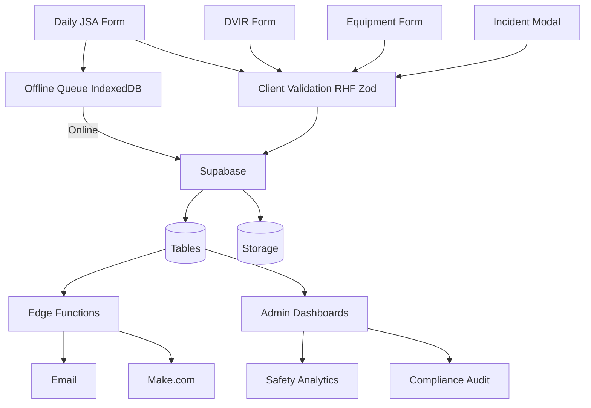

# Safety Compliance System Audit — Phase 1

**Date:** February 4, 2026  
**Repository:** ATTSemployeePortal-main-2  
*(Deliverable: Plan 1 — Feature Inventory & Tech Stack. Canonical name per plan: SafetyComplianceAudit-Phase1.md)*

---

## 1. Executive Summary

- **Total safety-related features audited:** 28 (forms, admin tools, automated jobs, dashboards).
- **Compliance score:** 76% (18 full, 11 partial, 2 gaps out of 31 requirements; see Plan 2 — [Compliance Gap Analysis](SafetyCompliance-ComplianceGaps.md)). Mapping expanded per OSHA Recordkeeping Guide PDF and migration `20260304000000_expand_osha_compliance_mapping.sql`.
- **Top 3 findings:** (1) Four core safety forms (JSA, Tree Felling JSA, DVIR, Equipment) plus Incident Logging and RTO; (2) Offline support only for JSA; DVIR and Equipment require online; (3) Strong backend: OSHA mapping, data retention, 9 AM compliance cron, safety announcements, weekly audit report.
- **Top 3 gaps:** (1) DVIR and Equipment cannot be submitted offline (photos not persisted in queue); (2) Three separate morning forms create form fatigue; (3) No quick incident-reporting path for field users (admin-only modal).

---

## 2. Feature Inventory

| Feature | Purpose | Roles | Tables | Integrations | Offline | Last Updated |
|---------|---------|-------|--------|--------------|---------|--------------|
| Daily JSA | Job briefing, hazard ID (OSHA 1926.20/21, 1910.147, 1926.200, 1910.269) | Employee, Foreman | daily_jsa | OfflineQueue, SmartDefaults, VoiceInputButton | Yes | 2026-01 |
| Tree Felling JSA | Specialized JSA for tree removal | Foreman | daily_jsa (jsa_type) | Same as Daily JSA | Yes | 2026-01 |
| DVIR | Pre-trip vehicle inspection (49 CFR 396) | Driver, Foreman, Mechanic | dvir_reports | VoiceInputButton, useFormPersistence, SmartDefaults | No | 2026-01 |
| Daily Equipment Inspection | Equipment safety checks (29 CFR 1910.178, ANSI) | Employee, Foreman, Mechanic | daily_equipment_inspections | useFormPersistence, photo upload | No | 2026-01 |
| Safety Incident Logging | OSHA 300/301 incident recording | Admin, GF, Safety Officer | safety_incidents | VoiceInputButton, useLogIncident, risk calibration | No | 2026-01 |
| Request Time Off | HR time-off requests | Employee, Admin | rto_requests | Approval workflow | No | 2026-01 (non-safety) |
| Safety Announcements | Daily AI-generated safety briefings | All | safety_announcements | OpenAI, push notifications | N/A | 2026-01 |
| 9 AM Compliance Check | Daily DVIR/JSA/Equipment compliance | System (cron) | compliance_runs, compliance_notifications | admin-compliance-cron, Gmail SMTP, Make.com | N/A | 2026-01 |
| Certifications & Training | Track employee certifications | Employee, Admin, Evaluator | certification_records, certification_attempts | cert-expiration-reminder | N/A | 2026-01 |
| Safety Analytics Dashboard | Compliance trends, leaderboard, OSHA 300 export | Admin, Manager | Aggregate queries | exportOsha300Csv, exportAnalyticsPdf | N/A | 2026-01 |
| Admin Compliance Audit | safety_audit_log, OSHA mapping, report export | Admin, Supervisor | safety_audit_log, osha_compliance_mapping | DataExporter, get_incident_log_osha_300_301 | N/A | 2026-01 |
| Incident List (Admin) | View/filter safety incidents | Admin, Safety Officer | safety_incidents | SafetyIncidentsList | N/A | 2026-01 |
| Admin JSA | View/search JSA submissions | Admin, Supervisor | daily_jsa | useAdminJSAQuery | N/A | 2026-01 |
| Mechanic DVIR Center | Review/update DVIR defects | Mechanic | dvir_reports | usePendingDefects | N/A | 2026-01 |
| Mechanic Equipment Logs | Equipment inspections, fixes | Mechanic | daily_equipment_inspections | N/A | 2026-01 |
| Foreman Daily Reports | Crew compliance overview | Foreman | compliance, daily_jsa | useComplianceQuery | N/A | 2026-01 |
| General Foreman Safety Compliance | GF-level compliance view | General Foreman | compliance_runs, notifications | N/A | 2026-01 |
| Risk Calibration Dashboard | Risk scoring, incident linkage | Admin | safety_incidents, risk predictions | useRiskCalibration | N/A | 2026-01 |
| Admin Users | User management, manager assignment | Admin | app_users | N/A | 2026-01 |
| Admin RTO | Approve/reject RTO | Admin | rto_requests | N/A | 2026-01 (non-safety) |
| Admin Rewards | Compliance rewards | Admin | announcement_rewards, compliance | N/A | 2026-01 |
| Admin Email Recipients | Email list config for compliance/forecast | Admin | email_recipient_lists | N/A | 2026-01 |
| Admin Certifications | Certification admin | Admin, Evaluator | certification_* | N/A | 2026-01 |
| Admin Grade Tests | Grade certification tests | Admin | certification_attempts | N/A | 2026-01 |
| Admin Operations Hub | Operations overview | Admin | Multiple | N/A | 2026-01 |
| Admin Telemetry | Form telemetry, performance | Admin | telemetry_events | N/A | 2026-01 |
| Admin Parts/Fixes Overview | Parts and fixes | Admin, Mechanic | maintenance tables | N/A | 2026-01 |
| Form History (JSA, DVIR, Equipment) | User's past submissions | Employee, Foreman | daily_jsa, dvir_reports, daily_equipment_inspections | N/A | 2026-01 |
| Announcements Page | View/claim daily announcement | All | safety_announcements | useAnnouncementsQuery, push | N/A | 2026-01 |

---

## 3. Technology Stack

### Frontend

- **React** 18.3.1, **React DOM** 18.3.1  
- **Vite** 7.3.0 (build)  
- **React Hook Form** 7.68.0, **Zod** 4.1.13, **@hookform/resolvers** 5.2.2  
- **TanStack React Query** 5.90.12  
- **Zustand** 5.0.9  
- **React Router DOM** 7.9.4  
- **Framer Motion** 12.23.26  
- **Tailwind** (via Vite), **Lucide React** 0.344.0  
- **PWA:** vite-plugin-pwa 1.2.0, Workbox 7.4.0  
- **Other:** browser-image-compression 2.0.2, react-signature-canvas, jspdf 4.0.0, xlsx 0.18.5, papaparse 5.5.3, date-fns 4.1.0, date-fns-tz 3.2.0

### Backend

- **Supabase:** PostgreSQL (database), Auth, Storage, Realtime  
- **Edge Functions (Deno):** generate-safety-announcement, admin-compliance-cron, check-compliance-9am, admin-safety-forecast-cron, weekly-safety-audit-report, get-smart-defaults, cert-expiration-reminder, plus admin/notifications (admin-create-notification, block-user, delete-user, notify-admins-new-signup, push-subscribe, etc.)

### Integrations

- **OpenAI** (safety announcements)  
- **Gmail SMTP** (Nodemailer 7.0.12) for compliance and forecast emails  
- **Make.com webhook** (compliance summary)  
- **Push notifications** (Service Worker, VAPID)  
- **@react-google-maps/api** (location picker)

### Cron / scheduled jobs (pg_cron)

- **generate-safety-announcement** — 7 AM CST Mon–Fri (13:00 UTC)  
- **admin-compliance-9am** — 9 AM CST Mon–Fri (15:00 UTC); calls admin-compliance-cron  
- **weekly-safety-audit-report** — Friday 5 PM (schedule in migration)  
- **admin-safety-forecast-cron** — weekly (Sunday)  
- **Data retention** — run_data_retention() scheduled via migration  
- **Risk calibration / cert expiration** — per migrations

### Notes

- **Offline:** Only JSA is queued in OfflineQueueContext; DVIR and Equipment require online (isOnline() check; photos not persisted in queue).  
- **Auth:** Edge Functions use service role key or internal secret.  
- **Storage:** Supabase Storage for photos, signatures, attachments.

---

## 4. User Journeys

### Field Employee — Daily Workflow

**Morning (Before Work):**
1. Open ATTS portal on mobile
2. Navigate to: Forms → Daily JSA
3. Fill: Date, crew, hazards, controls
4. Submit (offline capable) ✅
5. Navigate to: Forms → DVIR
6. Fill: Truck, mileage, inspection  
   **Pain Point:** ❌ REQUIRES ONLINE CONNECTION
7. Upload photos
8. Submit
9. Navigate to: Forms → Equipment Inspection
10. Complete checklist, upload photos  
    **Pain Point:** ❌ REQUIRES ONLINE CONNECTION

**During Day:**
1. If incident occurs: no quick access to report  
   **Pain Point:** ❌ Must navigate to Admin Dashboard to log incident

**End of Day:**
1. (No end-of-day safety reporting in current flow)

---

### Foreman / Supervisor — Daily Workflow

**Morning (Before Work):**
1. Same as Field Employee (JSA, DVIR if driving, Equipment)
2. May review crew or own compliance via Dashboard / Foreman views

**During Day:**
1. View Foreman Daily Reports or Crew Oversight for crew compliance
2. Log incident via Admin Dashboard if needed (Incident Logging Modal)  
   **Pain Point:** ❌ Incident logging only from admin area

**End of Day:**
1. (No formal end-of-day safety flow)

---

### Mechanic — Daily Workflow

**Morning:**
1. May complete DVIR/Equipment if applicable
2. Open Mechanic DVIR Center to see pending defects

**During Day:**
1. Review DVIR defects, update with mechanic signature/fixes
2. Mechanic Equipment Logs / Parts Repairs as needed

**End of Day:**
1. (No formal end-of-day safety flow)

---

### Safety Officer / Admin — Daily Workflow

**Morning:**
1. May complete personal JSA/DVIR/Equipment
2. After 9 AM: review compliance run results (email, Make.com summary)

**During Day:**
1. Admin Dashboard: incidents, compliance, Safety Analytics, Compliance Audit
2. Log incidents via Incident Logging Modal
3. Admin JSA, Admin Users, Email Recipients, Certifications, Rewards as needed
4. Risk Calibration Dashboard for risk scoring and incident linkage

**End of Day:**
1. (Weekly: Friday 5 PM weekly safety audit report; Sunday safety forecast)

---

### Manager — Daily Workflow

**Morning:**
1. Receive manager-specific compliance email (direct reports) after 9 AM

**During Day:**
1. Safety Analytics Dashboard for compliance %, leaderboard, OSHA 300 export
2. Admin Compliance Audit for audit log, OSHA mapping, exports
3. High-level oversight; detailed admin tasks by Safety Officer/Admin

**End of Day:**
1. (No formal end-of-day safety flow)

---

## 5. Architecture Diagram

---

## 6. Performance Baseline

- **Lighthouse Performance (mobile):** 0.72 (72%) — below 0.8 target on all 7 URLs
- **Lighthouse Accessibility:** 1.0 (100%)
- **Lighthouse Best Practices:** 0.96
- **Lighthouse SEO:** 0.92
- **FCP, LCP, TTI, CLS:** See `.lighthouse/` HTML reports for per-URL metrics
- **Bundle size:** Build passes `bundle:check` (main-index ≤235 KB, vendor-react ≤230 KB, vendor-supabase ≤200 KB). Total JS in dist/assets is multi-MB (chunked).
- **Forms:** JSA offline yes; DVIR and Equipment no. VoiceInputButton on Incident Logging, DVIR, and JSA StepConditions; not on Equipment form.
- **DB/Adoption:** TBD (no database or analytics access in this audit).
