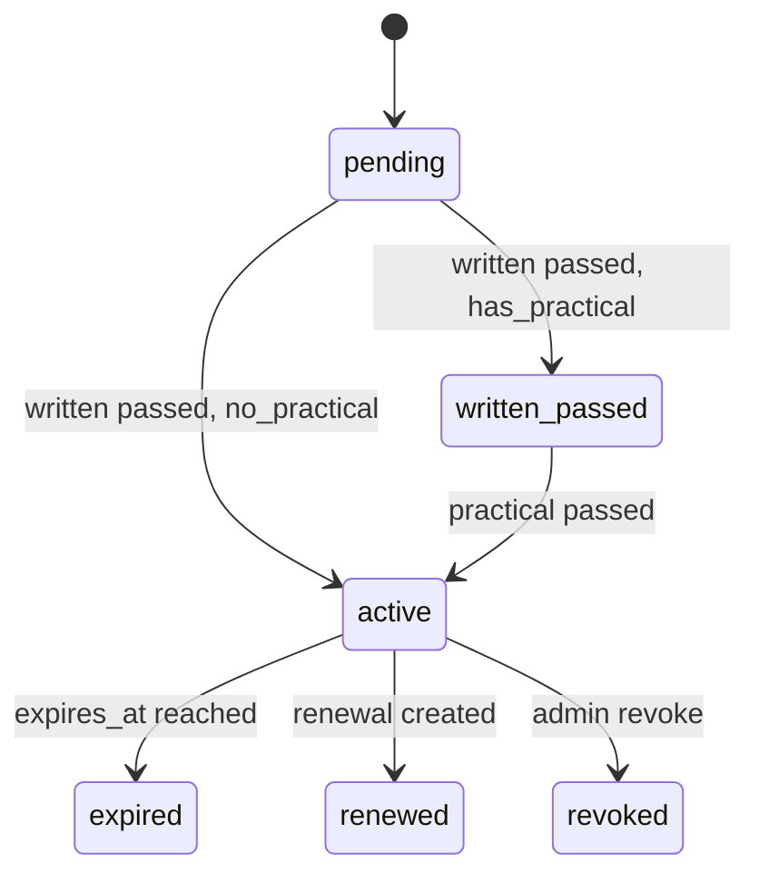
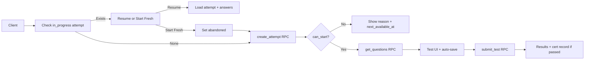

# ATTS Certification System — Revised Plan (v2)

This plan updates the original certification plan to address 10 critical issues (data modeling, security, scalability, UX) and incorporates Copilot’s implementation clarifications. It integrates with existing patterns: `app_users` (via `user_id`), `daily_jsa` + RLS, `notification_events` + dispatch, pg_cron, crews/crew_members.

---

## Phase 0.5: Verify Auth Schema (Do First)

**Before any certification migrations:**

1. Run:
   ```sql
   SELECT column_name, data_type, is_nullable
   FROM information_schema.columns
   WHERE table_name = 'app_users'
   ORDER BY ordinal_position;
   ```
2. **If `user_id` exists** (FK to `auth.users`, unique) → use `app_users.user_id = auth.uid()` in all RLS and RPCs. Proceed as planned.
3. **If `user_id` does NOT exist** (only `id` = auth PK) → replace every `app_users.user_id = auth.uid()` with `app_users.id = auth.uid()` in migrations and RPCs.
4. Update any references to `20251102034653` if the actual schema differs.

**Reference:** [20251102034653](supabase/migrations/20251102034653_create_app_users_table_and_trigger.sql) — `app_users` has `id` (PK), `user_id` (FK to `auth.users`, UNIQUE).

---

## 1. Database Schema (Phase 1)

**Migration:** `supabase/migrations/20260120300000_create_certification_system.sql`

Use the **state-machine schema** (audit trail, renewal tracking). Key points:

- **certification_types:** `category`, `has_written_test`, `has_practical_eval`, `is_active`, `validity_months`, `updated_at`. Add **`question_categories` JSONB** (e.g. `{"hardware": 0.4, "knots": 0.3, "observation": 0.3}`) for stratified sampling (Section 3).
- **certification_questions:** `category`, `difficulty`, `is_active`, `UNIQUE(certification_type_id, question_number)`.
- **certification_attempts:** `attempt_number`, `status` IN (`in_progress`, `submitted`, `graded`, **`abandoned`**), `submitted_at`, `time_spent_seconds`, `graded_by`/`graded_at`, `answers` JSONB. `UNIQUE(user_id, certification_type_id, attempt_number)`, indexes on `(user_id, certification_type_id)`, `(status)`.
- **practical_evaluations:** Standalone; keyed by `(user_id, certification_type_id)`. `checklist_items` JSONB — see **Section 1a**.
- **certification_records:** `written_attempt_id`, `practical_evaluation_id`, `certified_by`, `renewal_of`, `revoked_at`/`revoked_by`/`revoked_reason`. Status flow: `pending` → `written_passed` → `active` → `expired` | `revoked` | `renewed`. Partial unique index for one active/pending per `(user_id, certification_type_id)`.
- **Expiration job:** `update_expired_certifications()` + pg_cron daily (e.g. 02:00 UTC).

---

### 1a. Practical Evaluation — Checklist Schema and Templates

**Table: `practical_evaluation_templates`** (new)

```sql
CREATE TABLE practical_evaluation_templates (
  id UUID PRIMARY KEY DEFAULT gen_random_uuid(),
  certification_type_id UUID NOT NULL REFERENCES certification_types(id),
  category_name TEXT NOT NULL,
  category_order INTEGER NOT NULL,
  items JSONB NOT NULL,  -- [{"item_id": "hw1", "item_name": "Boom"}, ...]
  items_count INTEGER NOT NULL,
  UNIQUE(certification_type_id, category_name)
);
```

**`practical_evaluations.checklist_items` JSONB shape:**

```json
{
  "hardware_identification": [
    {"item_id": "hw1", "item_name": "Boom", "passed": true, "notes": ""},
    {"item_id": "hw2", "item_name": "Bucket", "passed": true, "notes": ""}
  ],
  "knots_and_rigging": [
    {"item_id": "knot1", "item_name": "Bowline", "passed": true, "notes": ""},
    {"item_id": "knot2", "item_name": "Clove Hitch", "passed": false, "notes": "Needs practice"}
  ],
  "trimmer_observation": [
    {"item_id": "obs1", "item_name": "Proper PPE", "passed": true, "notes": ""}
  ]
}
```

**Validation (in RPC or trigger):**

- All categories from the template must be present.
- All items from the template must be evaluated (`passed` true/false).
- `items_total` = sum of template `items_count`; `items_passed` = count where `passed = true`.

---

## 2. RLS Policies (Phase 2)

**Migration:** `supabase/migrations/20260120300001_create_certification_rls_policies.sql`

- **certification_types:** Public read for `is_active = true`. Full CRUD only for `app_users.role = 'admin'` (use `app_users.user_id = auth.uid()` per Phase 0.5).
- **certification_questions:** No direct SELECT; access only via RPCs.
- **certification_attempts:**
  - **SELECT:** own rows only (`user_id = auth.uid()`).
  - **INSERT:** own rows only (`user_id = auth.uid()`).
  - **UPDATE (client):** **Only when `status = 'in_progress'`** and owner. Enforce:
    - `WITH CHECK`: `user_id = auth.uid()` and `status = 'in_progress'`.
    - Client **cannot** change `status`, `score_percentage`, `passed`, `graded_at`, `graded_by`. Prevent status change via client (e.g. `status = (SELECT status FROM certification_attempts WHERE id = certification_attempts.id)` in WITH CHECK).
  - **No separate UPDATE policy for grading.** All grading is done in `submit_certification_test` (SECURITY DEFINER). Once status is `submitted` or `graded`, client can no longer UPDATE.

---

## 3. Secure Test Delivery, Grading, and Question Selection (Phase 3 RPCs)

**Migration:** `supabase/migrations/20260120300002_certification_rpc_functions.sql`

### 3.1 Question Selection Strategy

**Decision:** **Option B — Stratified sampling by category** (MVP).

- Use `certification_types.question_categories` (e.g. `{"hardware": 0.4, "knots": 0.3, "observation": 0.3}`).
- **`get_certification_test_questions(cert_type_slug, test_attempt_id)`:**  
  For each category, `ORDER BY RANDOM() LIMIT CEIL(question_count * proportion)`, then `UNION ALL` and final `ORDER BY RANDOM()` for display. Return only `question_id`, `question_number`, `question_text`, `question_type`, `options`, `points`, `category` — **never `correct_answer`**. Verify attempt ownership and `status = 'in_progress'`. SECURITY DEFINER.

**Alternatives (document only):** Option A = random subset (simpler, less balanced). Option C = fixed set (no randomization).

### 3.2 Grading Rules (MVP)

- **Multiple choice:** 1 point if `user_answer = correct_answer`, else 0.
- **True/false:** 1 point if `user_answer = correct_answer`, else 0.
- **No partial credit** in MVP.
- **No negative marking** in MVP.
- **Future (Phase 15+):** `question_type = 'multiple_select'`, `partial_credit_rules` JSONB, array answers.

### 3.3 RPCs

- **`get_certification_test_questions`** — stratified sampling, no answers (Section 3.1).
- **`submit_certification_test(test_attempt_id, user_answers)`** — grade MC/TF only; update attempt; create/update `certification_records` (written-only vs written+practical). Returns `(passed, score_percentage, correct_answers, total_questions)`. SECURITY DEFINER.
- **`can_start_certification_attempt(cert_type_id, check_user_id)`** — returns `(can_start, reason, next_available_at)`. 24h cooldown after failure.
- **`create_certification_attempt(cert_type_slug)`** — checks `can_start`, computes `attempt_number`, inserts attempt, returns `id`. SECURITY DEFINER.

---

## 4. Retake Cooldown (24h After Failure)

Same migration as Section 3. Implement via `can_start_certification_attempt` and `create_certification_attempt`. Frontend: call `can_start` before starting; if false, show toast with `reason` and `next_available_at`. Start only via `create_certification_attempt` → `get_certification_test_questions` → `submit_certification_test`.

---

## 5. Open-Ended Questions

**MVP:** **Option A — drop open-ended.** Use only `multiple_choice` and `true_false`. Revisit later (e.g. hybrid + manual/AI grading).

---

## 6. Tree Felling JSA — Single Table, Safe Migration

**Decision:** Single table. Add to `daily_jsa`:

- **`jsa_type`** — `TEXT`, then `NOT NULL DEFAULT 'daily'`, `CHECK (jsa_type IN ('daily', 'tree_felling'))`.
- **`tree_felling_data`** — `JSONB`.

**Migration:** `supabase/migrations/20260120300003_add_tree_felling_jsa.sql`

**Safe backfill sequence:**

1. Add `jsa_type` as **nullable**.
2. `UPDATE daily_jsa SET jsa_type = 'daily' WHERE jsa_type IS NULL`.
3. `ALTER COLUMN jsa_type SET NOT NULL`, `SET DEFAULT 'daily'`, `ADD CONSTRAINT check_jsa_type`.
4. Add `tree_felling_data JSONB`.
5. `CREATE INDEX idx_daily_jsa_jsa_type ON daily_jsa(jsa_type)`.

Preserve existing RLS. No new policies.

---

## 7. Study Guides

**MVP:** Markdown in repo under `src/content/certifications/` (e.g. `bucket-trimmer-study-guide.md`). Render via MD/MDX or simple markdown renderer. Optional later: `study_guide_sections` table.

---

## 8. Practical Evaluation — Evaluator Authorization

**Migration:** `supabase/migrations/20260120300004_practical_evaluator_authorization.sql`

- **`can_evaluate_user(evaluator_id, evaluatee_id, cert_type_id)`** → boolean. Admin: anyone. General foreman: anyone **except self** (Option A). Option B: restrict to same crew via `crew_members`. MVP: Option A.
- Enforce in “create practical evaluation” RPC; optionally CHECK on `practical_evaluations`.

---

## 9. Expiration Notifications (Phase 10)

- **Table:** `certification_expiration_notifications` — `(certification_record_id, notification_type, scheduled_for, sent_at)`, `UNIQUE(certification_record_id, notification_type)`.
- **Edge Function:** `cert-expiration-reminder`, invoked by Supabase Cron (or pg_cron). Uses **service role**.
- **Idempotent behavior:**
  - For each window (30/14/7/0 days): find due certs, then for each cert **check** `certification_expiration_notifications` for that `(certification_record_id, notification_type)`.
  - If **already sent** (`sent_at` set) → skip.
  - Else: create `notification_events` row (`category = 'certification_expiry'`; add to CHECK), `target_type = 'user'`, `target_ref = user_id`. **UPSERT** into `certification_expiration_notifications` with `onConflict: 'certification_record_id,notification_type'`, set `sent_at`. Then call `notifications-dispatch` (internal key).
- Add `certification_expiry` to `notification_events.category` CHECK and to `NotificationCategory` in `src/types/notifications.ts`.

---

## 10. Analytics (Phase 11) — Materialized Views

- **`certification_completion_stats`:** By cert type: `total_attempts`, `passed_users`, `avg_passing_score`, `avg_attempts_to_pass` (graded only). **Materialized view.**
- **`user_certification_matrix`:** User × cert type, `status`, `expires_at`, `compliance_status` (`compliant` | `expiring_soon` | `non_compliant`). **Materialized view.**
- **Refresh:** pg_cron daily (e.g. 03:00 UTC): `REFRESH MATERIALIZED VIEW certification_completion_stats`, `REFRESH MATERIALIZED VIEW user_certification_matrix`.
- Admin UI queries materialized views. Optional: “Refresh” button that runs `REFRESH MATERIALIZED VIEW` (via RPC or admin-only Edge Function).

---

## 11. Question Import Tooling (Phase 2 Addition)

**File:** `scripts/import-cert-questions.ts` (or `.js`)

**Usage:** e.g. `npx tsx scripts/import-cert-questions.ts bucket-trimmer-questions.csv`

**CSV format (example):**

```csv
question_number,category,difficulty,question_type,question_text,option_a,option_b,option_c,option_d,correct_answer,points
1,hardware,easy,multiple_choice,What is the main lifting arm called?,Jib,Boom,Bucket,Turret,B,1
2,hardware,medium,true_false,The bucket is rated for 2 workers.,TRUE,FALSE,,,B,1
```

**Script:** Parse CSV, validate (columns, `correct_answer` in options, etc.), insert into `certification_questions` via Supabase client, report errors.

---

## 12. Test Resume (Phase 6 Addition)

- **Before starting:** Check for existing `certification_attempts` with `user_id`, `certification_type_id`, `status = 'in_progress'`.
- If found → modal: **“Resume”** or **“Start Fresh”**.
  - **Resume:** Navigate to `/resources/certification/:certSlug/test/:attemptId`, load questions via RPC, pre-fill from `answers` JSONB.
  - **Start Fresh:** Update old attempt to `status = 'abandoned'`, then call `create_certification_attempt` and proceed.
- **Auto-save:** Persist `answers` to `certification_attempts.answers` (via UPDATE, permitted only when `in_progress`) every ~30s. On resume, pre-fill from saved state.

**Schema:** Add `abandoned` to `certification_attempts.status` CHECK.

---

## 13. Implementation Order (Revised)

| Order | Phase | Description |
|-------|-------|-------------|
| 0 | **0.5** | Verify `app_users` schema (user_id vs id) |
| 1 | **1** | DB schema (tables, indexes, expiration trigger, cron) |
| 2 | **2** | RLS |
| 3 | **3** | RPCs (test delivery, grading, cooldown, create attempt) |
| 4 | **4** | Seed Bucket Trimmer (MC/TF) + import script |
| 5 | **5** | Resources page (Certifications, Study guides, Training, Safety) |
| 6 | **6** | Digital test module (RPCs, 24h cooldown UX, **resume + auto-save**) |
| 7 | **7** | Practical evaluation form + evaluator auth |
| 8 | **8** | Admin certification dashboard + GF view |
| 9 | **9** | Study guides content (markdown) |
| 10 | **10** | Tree Felling JSA (`jsa_type`, `tree_felling_data`) |
| 11 | **11** | JSA type picker (Forms.tsx, JsaTypePicker) |
| 12 | **12** | Expiration notifications (table, Edge Function, cron, idempotent) |
| 13 | **13** | Analytics (materialized views, refresh cron, admin UI) |
| 14 | **14** | Remaining certs (Geo-Boy, Groundsman, Jarraff, Skid Steer) |

---

## 14. File and Route Summary

- **Migrations:**  
  `20260120300000_create_certification_system.sql`,  
  `20260120300001_create_certification_rls_policies.sql`,  
  `20260120300002_certification_rpc_functions.sql`,  
  `20260120300003_add_tree_felling_jsa.sql`,  
  `20260120300004_practical_evaluator_authorization.sql`,  
  plus expiration-notifications and `certification_expiry` category changes.

- **Frontend:**  
  `Resources.tsx`, `Forms.tsx`, certification test/practical pages, `TreeFellingJSAForm`, `AdminCertifications`, `certifications/*`, `JsaTypePicker`, `src/content/certifications/*.md`, `useCertifications`, `types/certifications.ts`.

- **Routes:**  
  `/resources`, `/resources/certification/:certSlug/test`, `/resources/certification/:certSlug/test/:attemptId` (resume),  
  `/resources/certification/:certSlug/practical/:userId`, `/admin/certifications`,  
  `/forms/jsa`, `/forms/jsa/tree-felling`, `/forms/jsa/tree-felling/:id`.

- **Edge Functions:**  
  `cert-expiration-reminder` (cron).

- **Scripts:**  
  `scripts/import-cert-questions.ts`.

---

## 15. Open Decisions (Confirm Before Coding)

1. **Evaluator scope:** Option A (GF evaluates anyone except self) vs Option B (same crew only). **Recommendation:** Option A for MVP.
2. **Open-ended questions:** Dropped for MVP (Option A). Confirm.
3. **Cron for expiration:** Supabase Cron → Edge Function vs pg_cron + DB function. **Recommendation:** Supabase Cron → Edge Function.

---

## 16. Diagrams

**Certification record state machine:**



**Test flow (including resume):**



---

**Next step:** Run Phase 0.5 schema check, then proceed with migrations in order.
