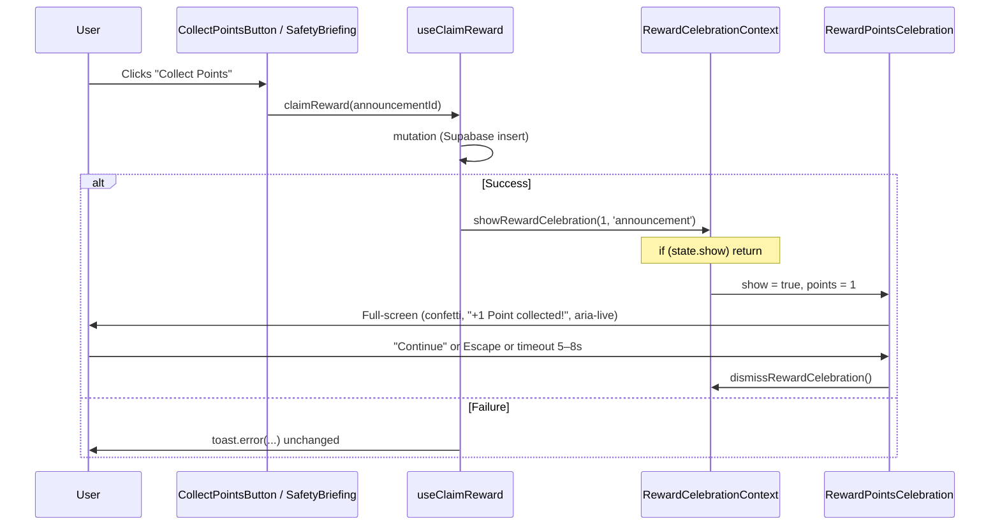

# Full-Screen Animated Reward and Compliance Celebration — Plan (revised)

This plan replaces the simple corner toast for announcement reward claims with a full-screen animated celebration and optionally surfaces compliance points in existing form/compliance overlays. The following sections incorporate error handling, double-trigger guard, context justification, performance, compliance data flow, backdrop dismiss behavior, and accessibility.

---

## 1. Error and edge case handling

- **Explicit rule:** Error toasts remain unchanged; only the success toast is replaced by the full-screen celebration.
- In [useAnnouncementRewards.ts](src/hooks/useAnnouncementRewards.ts), the mutation’s `onError` continues to call `toast.error(...)` (and optionally invalidate queries) as it does today. Do not remove or change the error path. If the mutation fails (network, duplicate claim, outside claim window, etc.), the user must still see a toast or other feedback — never silence on failure.

---

## 2. Double-trigger guard

- If the user taps “Collect Points” twice quickly (common on mobile), the mutation can succeed once or twice before the overlay appears, so `showRewardCelebration` could be called multiple times.
- In the reward celebration context, inside `showRewardCelebration(points, source)`: **if `state.show` is already true, return immediately** (no re-entry, no stacking). Optionally update `points` if you want the last value to win; otherwise ignore. A simple `if (state.show) return;` guard is sufficient. The DB side is idempotent (unique constraint / upsert); the UI should not flash or show multiple overlays.

---

## 3. Context justification (why context instead of local state or custom toast)

- Adding a context, a provider in App, and a portal component is non-trivial. The alternative would be: local state + portal inside each caller (CollectPointsButton, SafetyBriefingPage), or a custom “toast” that renders the full-screen overlay via Sonner’s custom content API (if supported).
- **We chose the context approach because:**
  - **Multiple claim sources:** Announcement (CollectPointsButton on Announcements and FeaturedAnnouncementSection), briefing (SafetyBriefingPage “Claim your reward points”), and optionally a future compliance-claim flow all trigger a reward. A single context gives one place to show the celebration regardless of which screen the user is on.
  - **Single overlay instance:** One provider-mounted overlay avoids duplicate portals and ensures consistent behavior (scroll lock, z-index, accessibility) without each page implementing the same logic.
  - **Hook stays simple:** `useClaimReward()` stays a plain mutation; it doesn’t need to accept render props or callbacks from every caller. The hook calls `showRewardCelebration(1, 'announcement')` and the rest is centralized.
- If the product were “only ever announcement claim from one button,” local state in that one component would be simpler. Given multiple current and potential future sources, the context’s indirection is justified.

---

## 4. Current behavior (recap)

- **Announcement reward (Collect Points):** [useClaimReward()](src/hooks/useAnnouncementRewards.ts) on success calls `toast.success('🎉 +1 Point collected!')`. Entry points: [CollectPointsButton](src/components/CollectPointsButton.tsx) (Announcements, FeaturedAnnouncementSection) and [SafetyBriefingPage](src/pages/SafetyBriefingPage.tsx).
- **Compliance reward:** [FormSuccessCelebration](src/components/forms/FormSuccessCelebration.tsx) (single form) and [FullComplianceCelebration](src/components/compliance/FullComplianceCelebration.tsx) (all three forms) are already full-screen. They do not yet show an explicit “X points earned” line.

---

## 5. Target behavior

1. **Announcement reward:** Show a full-screen animated celebration (confetti, “+1 Point collected!”, emerald/amber theme, dismiss via button or Escape) instead of the corner toast when a reward is claimed via `useClaimReward`. Error path still uses `toast.error` (unchanged).
2. **Compliance (optional):** Optionally show compliance points in the existing full-screen celebrations; see Section 10 for data flow and client-side derivation.

---

## 6. Reward celebration context and component

- **Context** (e.g. `src/contexts/RewardCelebrationContext.tsx`):
  - State: `{ show: boolean, points: number, source: 'announcement' | 'briefing' }`.
  - `showRewardCelebration(points: number, source?: 'announcement' | 'briefing')`: set show true, store points/source. **Guard:** if `state.show` is already true, return without updating (double-trigger guard).
  - `dismissRewardCelebration()`: set show false.
- **Full-screen component** (`RewardPointsCelebration`, e.g. `src/components/rewards/RewardPointsCelebration.tsx`):
  - Same pattern as [FormSuccessCelebration](src/components/forms/FormSuccessCelebration.tsx): `createPortal(..., document.body)`, lock `document.body` and `[data-scroll-container]` overflow when visible.
  - **Dismiss:** “Continue” button and Escape only. **Backdrop does not dismiss** — match [FormSuccessCelebration](src/components/forms/FormSuccessCelebration.tsx), where the backdrop has no onClick (dismiss only via Continue or Escape).
  - **Accessibility:** Use `role="alertdialog"` and an `aria-live="assertive"` region (or equivalent) so screen readers announce “+1 Point collected!” (or the headline) immediately when the overlay opens — giving screen reader users an equivalent moment to the confetti for sighted users. Trap focus in the overlay and restore on dismiss; support Escape to close.
- **Provider:** Wrap the app subtree that can claim rewards; render a single `RewardPointsCelebration` inside the provider that subscribes to context. Mount in [App.tsx](src/App.tsx).

---

## 7. Wire announcement reward to full-screen celebration

- In [useAnnouncementRewards.ts](src/hooks/useAnnouncementRewards.ts), in `useClaimReward`:
  - Use the new context: e.g. `const { showRewardCelebration } = useRewardCelebration()`. If the hook is used outside the provider, guard (no-op or optional fallback to toast).
  - In the mutation’s **onSuccess:** call `showRewardCelebration(1, 'announcement')` and **remove** the `toast.success('🎉 +1 Point collected!')` call.
  - Leave **onError** exactly as is: keep `toast.error(...)` so the user always gets feedback on failure.

---

## 8. Confetti performance on low-end devices

- The crew uses phones in the field; Framer Motion confetti with many particles can cause frame drops on older Android devices.
- **Particle count:** Cap at **20–30** particles max (not 50+).
- **Rendering:** Use CSS transforms for position/rotation; avoid layout-triggering properties. Set `will-change: transform` on particle elements where appropriate.
- **Reduced motion:** Respect `prefers-reduced-motion`: reduce or skip confetti when the user prefers reduced motion.
- **Auto-dismiss:** Add a **hard timeout** (e.g. 5–8 seconds) after which the overlay auto-dismisses (call `dismissRewardCelebration()`), so if the user doesn’t tap “Continue” (phone in pocket, distracted), the overlay doesn’t stay forever. Optionally show a subtle “Closing in 5…” countdown if desired.

---

## 9. Optional: compliance points in existing overlays

- **Data flow gap:** At celebration time (right after form submit), the client does **not** yet have a `compliance_rewards` row — the 9 AM cron writes those later. So “2 vs 5 points” cannot be read from the DB at the moment the overlay is shown.
- **Where the decision is made:** The “how many forms complete today” logic already lives on the client in `checkAndCelebrate` (e.g. in [useComplianceToast.ts](src/hooks/useComplianceToast.ts)): it fetches compliance status and derives `remaining` and `allComplete`. So the client already knows “1 of 3” vs “2 of 3” vs “3 of 3” at celebration time.
- **Implementation options:**
  - **Option A:** Have the caller of `checkAndCelebrate` (or the hook) compute points client-side: if `allComplete` use `full_compliance_points`, else use `partial_compliance_points` from `app_settings.reward_points_config` (e.g. via [useAppSettings](src/hooks/queries/useAppSettings.ts)). Pass `pointsEarned: number` into [FormSuccessCelebration](src/components/forms/FormSuccessCelebration.tsx) and [FullComplianceCelebration](src/components/compliance/FullComplianceCelebration.tsx), and show “You earned X points” in the overlay.
  - **Option B:** The overlay components read `reward_points_config` and receive `completedCount: 1 | 2 | 3` (or `allComplete: boolean`); they derive points locally and display them. This avoids threading new props through every form page but duplicates the “partial vs full” rule in the UI.
- Either way, the **2 vs 5 points** decision is made on the client from “how many of the three forms are complete today” (same info as `checkAndCelebrate`), not from `compliance_rewards` rows. Document this in the implementation so future changes to point values stay in sync (e.g. single source of truth in `reward_points_config`).

---

## 10. Files to add/change (summary)

| Action | File |
|--------|------|
| Add | `src/contexts/RewardCelebrationContext.tsx` — context + provider + double-trigger guard in `showRewardCelebration` |
| Add | `src/components/rewards/RewardPointsCelebration.tsx` — full-screen overlay (portal, scroll lock, confetti cap 20–30, will-change, auto-dismiss 5–8s, role="alertdialog", aria-live, backdrop not clickable) |
| Edit | `src/hooks/useAnnouncementRewards.ts` — use context in onSuccess, remove success toast, keep error toasts unchanged |
| Edit | `src/App.tsx` — wrap with `RewardCelebrationProvider`, render `RewardPointsCelebration` inside |
| Optional | `FullComplianceCelebration` / `FormSuccessCelebration` + callers — pass or derive points (Section 9) and display “You earned X points” |

---

## 11. Flow diagram

---

## 12. Checklist before implementation

- [ ] Error toasts in `useClaimReward` onError left unchanged.
- [ ] Double-trigger guard: `if (state.show) return` in `showRewardCelebration`.
- [ ] Confetti: max 20–30 particles, CSS transforms, will-change, prefers-reduced-motion.
- [ ] Auto-dismiss after 5–8 seconds.
- [ ] Backdrop does not dismiss; only Continue and Escape.
- [ ] Overlay: `role="alertdialog"` and aria-live/assertive so screen readers announce the reward.
- [ ] Context justified for multiple claim sources (announcement, briefing, future compliance).
